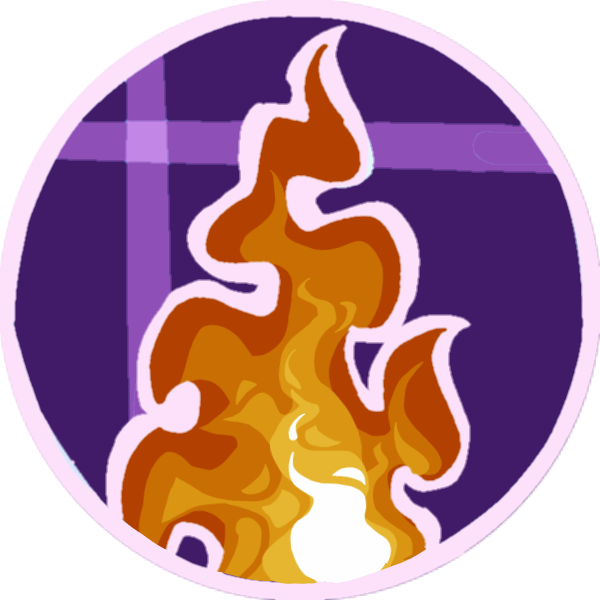
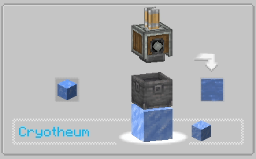
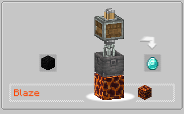

<div align="center">

# Create Heat JS

[中文](README_zh.md) | **English**



[![curseforge-badge]][curseforge-url] [![modrinth-badge]][modrinth-url] [![github-badge]][github-url]
</div>

Allows using KubeJS to customize Create's Heat Source Blocks and Heat Levels.

Please use [KubeJS Create Mod](https://modrinth.com/mod/kubejs-create/) when adding recipes, and use the `.heatLevel()` method to set the heat level.

## Example




### Client Scripts

```js
ClientEvents.lang("en_us", (event) => {
    event.add("create.recipe.heat_requirement.blaze", "Blaze");
    event.add("create.recipe.heat_requirement.cryotheum", "Cryotheum");
    event.add("create_heat_js.heat_source.cryotheum.soul_lantern.tip", "needs to be in the nether dimension");
});
```

### Startup Scripts

```js
ServerEvents.recipes((event) => {
  event.recipes.create.mixing("minecraft:diamond", "minecraft:coal_block").heatLevel("BLAZE");
  event.recipes.create.compacting("thermal:blizz_powder", "minecraft:blue_ice").heatLevel("CRYOTHEUM");
});
```

### Server Scripts

```js
CreateHeatJS.registerHeatEvent(event => {
    // 1. Basic Example: Register custom heat source BLAZE
    // Use addHeatSource(String blockId) - The most common way
    event.registerHeat("BLAZE", builder => builder
        .color(0xFF4500)
        .addHeatSource("minecraft:magma_block") //Block
        .satisfies("HEATED")
    )

    // 2. Advanced Example: Register CRYOTHEUM
    // Demonstrates the use of all overloaded methods
    event.registerHeat("CRYOTHEUM", data => data
        .color(0x00BFFF)
        .addHeatSource("#minecraft:ice") //BlockTags

        // Example: If in the Nether (dimension check), and the block is soul_lantern
        .addHeatSourceIf((level, pos) => {
            if (level.dimension === "minecraft:the_nether") {
                return level.getBlockState(pos).block.id === "minecraft:soul_lantern"
            }
            return false
        },"minecraft:soul_lantern",Component.translatable("create_heat_js.heat_source.cryotheum.soul_lantern.tip"))

        // Relationship: Satisfies HEATED condition
        .satisfies("HEATED")

        // Conditional Relationship: Satisfies only in specific recipes
        // Example: If recipe ID is "create:mixing/lava_from_cobble", it is considered to satisfy "SUPERHEATED"
        .satisfiesIf("SUPERHEATED", ctx => ctx.getRecipeId() == "create:mixing/lava_from_cobble"))

    /**
     * Add heat source (supports string format)
     * Supported formats:
     * - blocktag:namespace:path (Block Tag)
     * - fluidtag:namespace:path (Fluid Tag)
     * - block:namespace:path (Block ID)
     * - fluid:namespace:path (Fluid ID)
     * - namespace:path[prop=value] (Block State)
     * - #namespace:path (Try to match Block or Fluid Tag)
     *
     * @param heatSource Heat Source
     * @return Builder
     */
    //addHeatSource(String heatSource)
    
    /**
     * @param heatSourceDisplayItem Item displayed in JEI heat source slot
     * @return Builder
     */
    //heatSourceSlotItem(ItemStack heatSourceDisplayItem)
        
    /**
     * @param catalystDisplayItem Item displayed in JEI catalyst slot
     * @return Builder
     */
    //catalyst(ItemStack catalystDisplayItem)
    
    
    // You can use satisfies or satisfiesIf methods to perfect the heat level network, 
    // extending the original Create mod's linear relationship levels, allowing vertical, horizontal, and cross relationships.
    
    // Vertical Relationship
    event.bindSatisfies("TEST1", "TEST2") // The effect here is similar to the "SUPERHEATED", "HEATED" linear relationship of the Create mod.
    
    // Horizontal Relationship
    // Register a brand new level without using satisfies or satisfiesIf methods to bind the relationship network.
    
    // Cross Relationship
    // The CRYOTHEUM level registered above belongs to a horizontal independent system, 
    // but uses satisfies and satisfiesIf to cross back into the Create mod's SUPERHEATED, HEATED linear relationships.
})
```

[curseforge-badge]: https://raw.githubusercontent.com/intergrav/devins-badges/v3/assets/cozy/available/curseforge_vector.svg
[curseforge-url]: https://www.curseforge.com/minecraft/mc-mods/create-heat-js
[modrinth-badge]: https://raw.githubusercontent.com/intergrav/devins-badges/v3/assets/cozy/available/modrinth_vector.svg
[modrinth-url]: https://modrinth.com/mod/create-heat-js
[github-badge]: https://raw.githubusercontent.com/intergrav/devins-badges/v3/assets/cozy/available/github_vector.svg
[github-url]: https://github.com/XiaoHuNao/CreateHeatJS
